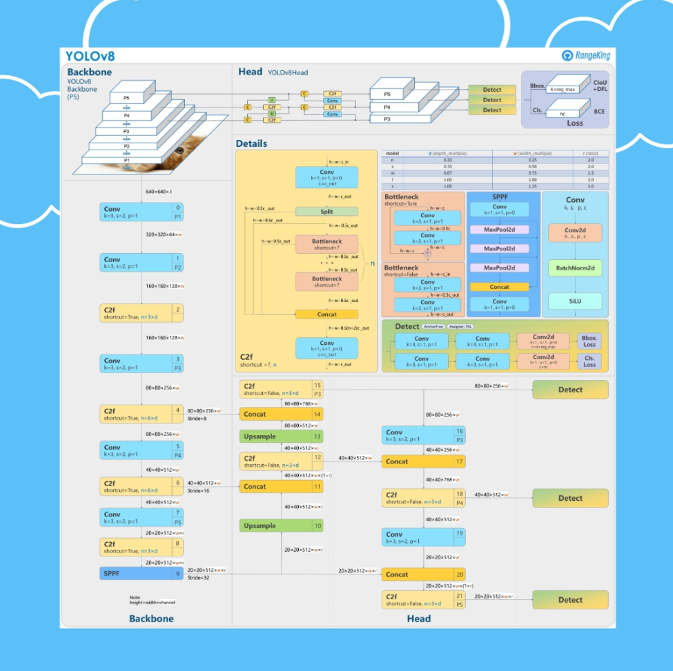
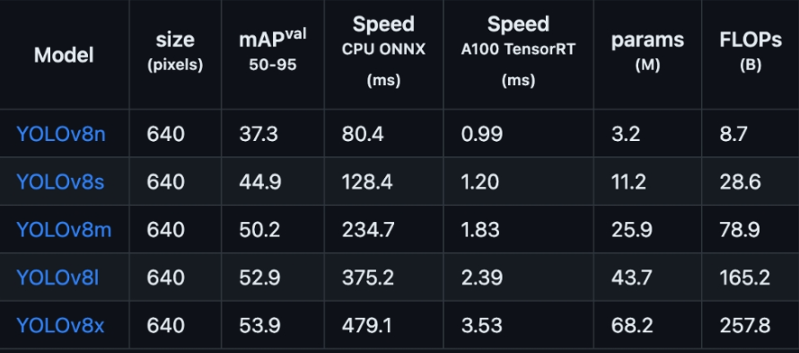

<<<<<<< HEAD
# Queen bee detection
As we all know, queen bee is relatively hard to be detected among a giant group of worker bees, because of 
the similar appearance and their tiny size for human beings. So if we wanna detect the queen bee, there are a
lot of tedious things to do, including construct the datasets with the queen bee contained, then we should utilize an
efficient detection model which could be fine-tuned to the novel datasets.
About how to distinct the queen bee from worker bees, the dominant help is the relative size between the queen 
and it's surrounding worker bees, concretely elaborated in this blog:
> https://zh.wikihow.com/%E5%88%86%E8%BE%A8%E8%9C%82%E7%8E%8B
## YOLOV8
Using the SOTA object detection model: yolov8. It's pipeline is shown below:


Within YOLOv8, we have different model sizes such as yolov8- n - nano, s - small, m - medium, 
l - large, and x - extra large.


In the project, I select three types of yolov8 models as the base model which are pretrained on large datasets
, .i.e, MicroSoft COCO or Imageset, users can select one of which on the basis of the performance of devices.
## Setting up your machine for YOLOv8
```
conda create -n yolo_env python==3.8
conda activate yolo_env
conda install pytorch torchvision torchaudio -c pytorch
pip install -U ultralytics
``` 
## Training for detection
Run the finetune_training.py, the yolov8 model will be trained under the queen_worker dataset.
```
python finetune_training.py
```
After getting trained model, we can use this model to detect an image or a video.
```
# test img
result = model(img_path, save=True, project="results/")
# test video
result = model(video_path, save=True, project="results/")
```
At last, if we run ```DetQueen.py```, we will see an user interface in which we can 
input images and videos, and waiting for a while, the corresponding results will be 
demonstrated.

2023/09/16, written by Bruce Young.
=======
# Queenbee_Detect
From a group of worker bees, find the queen bee
>>>>>>> e87345269bc67bce0f56b7883b28552306ce2538
